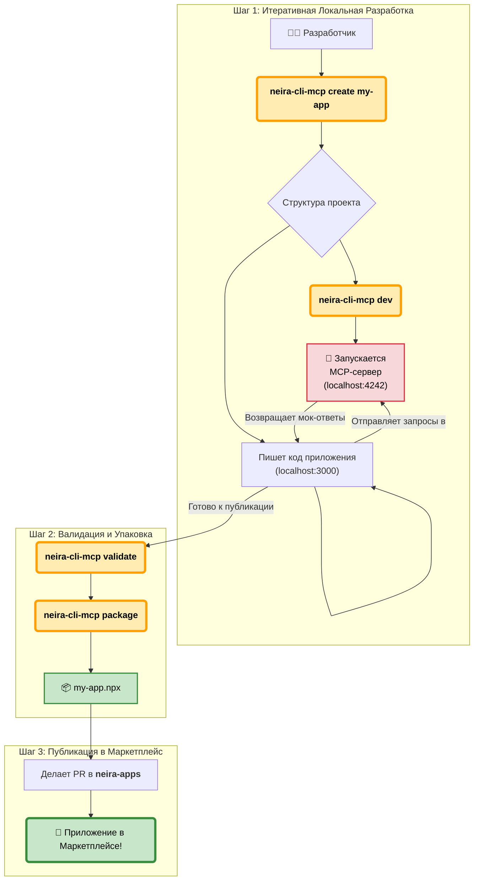

<div align="center">
  <a href="https://neira.ai" target="_blank">
    <!-- Замените на URL вашего логотипа -->
    
  </a>
  <br/>
  <h1>NEIRA CLI & MCP Server</h1>
  <p><strong>Официальный инструмент командной строки и локальный сервер для разработки, тестирования и упаковки приложений для Платформы NEIRA.</strong></p>
  
  <!-- Badges -->
  <p>
    <a href="https://www.npmjs.com/package/@neira/cli-mcp"></a>
    <a href="https://github.com/YourOrg/neira-cli-mcp/blob/main/LICENSE"></a>
    <a href="https://github.com/YourOrg/neira-cli-mcp/actions/workflows/ci.yml"></a>
    <a href="https://discord.gg/your-invite-link"></a>
  </p>
</div>

---

`@neira/cli-mcp` — это ваш незаменимый помощник в мире разработки для NEIRA. Мы создали этот инструмент, чтобы максимально упростить и ускорить путь от вашей идеи до публикации приложения в нашем маркетплейсе.

### ✨ Ключевые Возможности

*   **🚀 Быстрый старт:** Создайте готовую структуру для вашего нового приложения одной командой (`create`).
*   **📦 Интеграция с neira-shared-types:** Все создаваемые приложения автоматически включают общие TypeScript типы для консистентности API.
*   **⚡ Локальный Dev-сервер:** Запускайте **Model Context Protocol (MCP) Server** для отладки вашего приложения в окружении, имитирующем API ядра NEIRA, без запуска самого десктоп-приложения (`dev`).
*   **✅ Встроенная валидация:** Проверяйте ваш манифест `neira-app.json` на соответствие стандартам (`validate`).
*   **📦 Надежная упаковка:** Собирайте ваше приложение в единый `.npx` пакет, готовый к публикации (`package`).

### 🎯 Двойная роль: CLI + MCP-сервер

`neira-cli-mcp` — это не просто инструмент командной строки, а **гибридное решение**:

1. **CLI для разработчиков:** Стандартные команды для создания, валидации и упаковки приложений
2. **Локальный MCP-сервер:** Встроенный Express + WebSocket сервер для отладки Model Control Protocol интеграций

Это позволяет разработчикам тестировать AI-инструменты локально, не подключаясь к "боевому" облаку NEIRA. Особенно полезно для:
- Отладки MCP-команд и протоколов
- Тестирования интеграций с AI-моделями
- Разработки без интернет-соединения

### 💾 Установка

Для установки `neira-cli-mcp` глобально вам понадобится Node.js (v18+).

```bash
npm install -g @neira/cli-mcp
```
После установки команда `neira-cli-mcp` будет доступна в вашей системе.

---

### Workflow Разработчика (с MCP-сервером)

Новый рабочий процесс позволяет итеративно разрабатывать и тестировать ваше приложение локально.



Процесс создания приложения с помощью `neira-cli-mcp` состоит из трех простых этапов:

1.  **Локальная разработка:** Вы создаете, кодируете и тестируете приложение на своей машине.
2.  **Публикация на GitHub:** Вы выкладываете код в свой репозиторий и создаете релиз с упакованным приложением.
3.  **Добавление в Маркетплейс:** Вы отправляете Pull Request в наш [реестр приложений](https://github.com/YourOrg/neira-apps), чтобы ваше приложение появилось в NEIRA.

---

### 🛠️ Команды

#### `neira-cli-mcp dev`
**Ключевая команда для разработки.** Запускает локальный MCP-сервер. Сервер имитирует API ядра NEIRA, позволяя вашему UI-приложению (запущенному, например, на `localhost:3000`) отправлять запросы и получать ответы.
```bash
cd my-awesome-app
neira-cli-mcp dev

# ✅ MCP Server is running on http://localhost:4242
#  API:
#  - GET /api/v1/context
#  - POST /api/v1/chat/completions
#  - WS /api/v1/stream
#  Watching for changes in neira-app.json...
```

#### Другие команды
-   `neira-cli-mcp create <app-name>`: Создает новую директорию с полной структурой для вашего приложения.
-   `neira-cli-mcp validate`: Проверяет `neira-app.json` в текущей директории.
-   `neira-cli-mcp package`: Собирает ваше приложение в готовый к публикации пакет `.npx`.

---
### ⚙️ Model Context Protocol (MCP) Server
Сервер, запускаемый командой `dev`, является легковесной имитацией рантайма NEIRA. Он предоставляет вашему приложению стандартизированный API для:
-   Отправки сообщений модели и получения ответов (стриминг через WebSockets).
-   Получения текущего контекста чата.
-   Управления состоянием.

Это позволяет вам разрабатывать UI и логику приложения полностью изолированно.

### 🚀 Быстрый старт

1. **Создайте новое приложение:**
   ```bash
   neira-cli-mcp create my-awesome-app --description "Мое потрясающее приложение"
   cd my-awesome-app
   ```

2. **Запустите dev-сервер:**
   ```bash
   neira-cli-mcp dev
   ```

3. **В другом терминале запустите ваше приложение:**
   ```bash
   npm run dev
   # Ваше приложение будет доступно на localhost:3000
   # и сможет взаимодействовать с MCP-сервером на localhost:4242
   ```

4. **Когда готово к публикации:**
   ```bash
   neira-cli-mcp validate
   neira-cli-mcp package
   ```

### 📋 Структура проекта

После выполнения `create` вы получите:

```
my-awesome-app/
├── package.json            # Зависимости (включает neira-shared-types)
├── tsconfig.json           # Конфигурация TypeScript
├── src/
│   └── index.ts           # Основная логика с примерами типов
└── README.md              # Документация
```

### 🎯 Использование neira-shared-types

Все создаваемые приложения автоматически включают `neira-shared-types` — единый источник правды для TypeScript типов в экосистеме NEIRA:

```typescript
import { ApiResponse, User } from 'neira-shared-types';

// Создание пользователя с типизацией
const user: User = {
  id: '123',
  name: 'John Doe',
  email: 'john@example.com',
  createdAt: new Date().toISOString(),
  updatedAt: new Date().toISOString()
};

// API ответ с типизацией
const response: ApiResponse<User> = {
  success: true,
  data: user,
  message: 'User created successfully'
};
```

Это обеспечивает:
- ✅ Консистентность типов между клиентом и сервером
- ✅ Автокомплит в IDE
- ✅ Проверку типов на этапе компиляции
- ✅ Легкую рефакторинг кода

### 🤝 Поддержка

Если у вас есть вопросы или предложения:
- 📧 Напишите нам: support@neira.ai
- 💬 Присоединяйтесь к нашему Discord
- 🐛 Создайте issue в GitHub

---

<div align="center">
  <p>Сделано с ❤️ командой NEIRA</p>
</div>